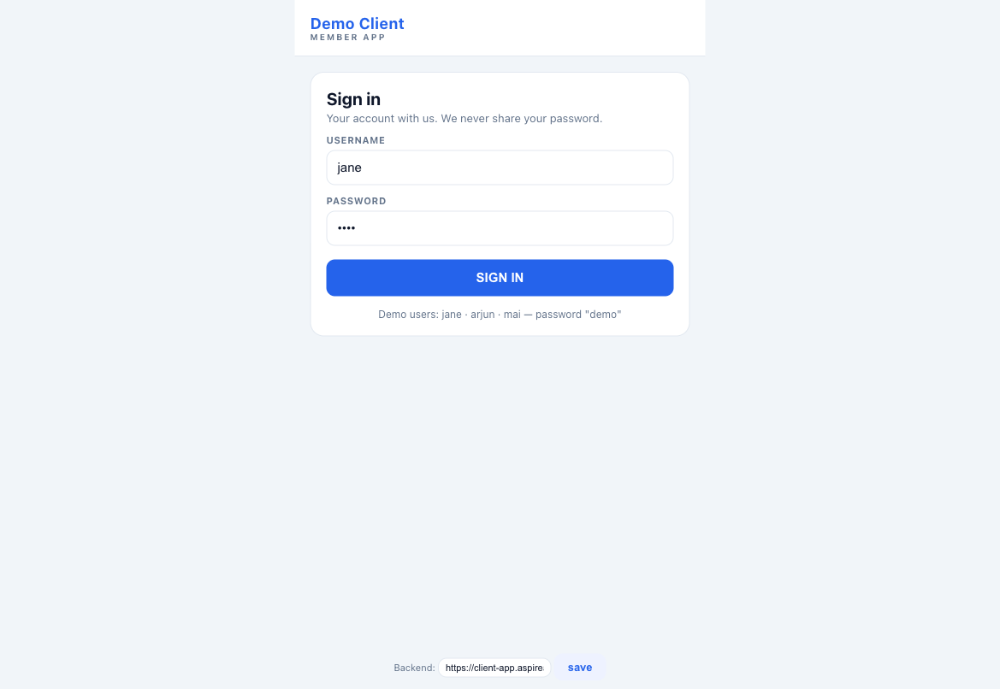
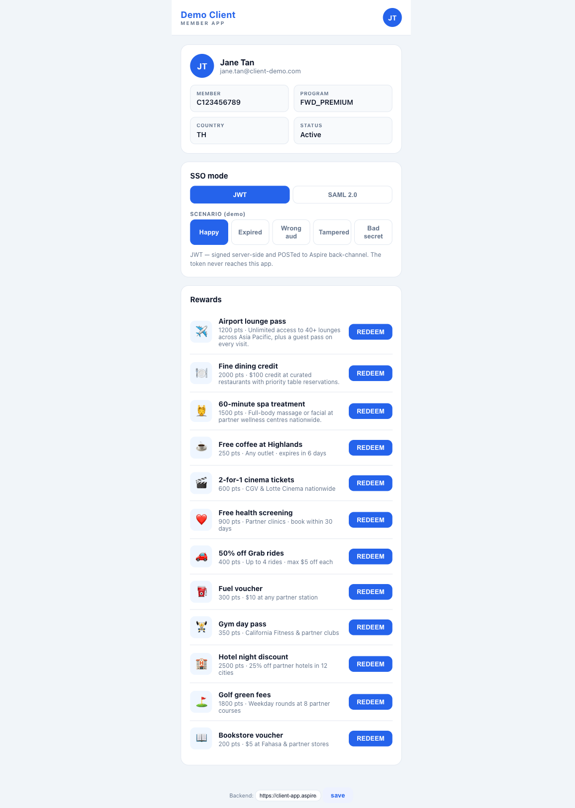
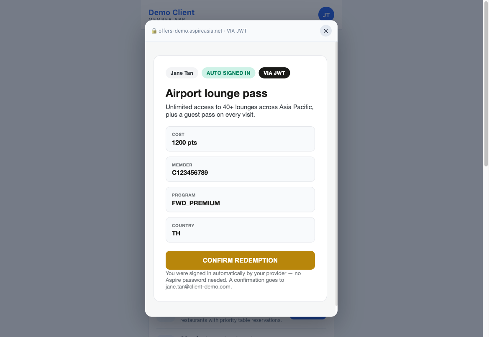
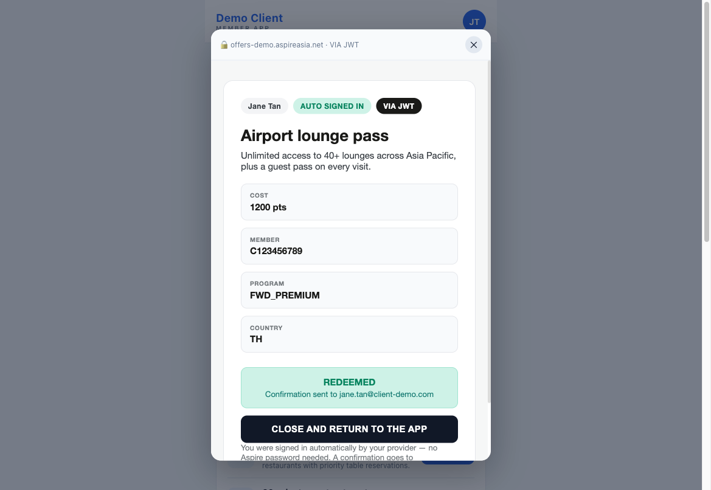
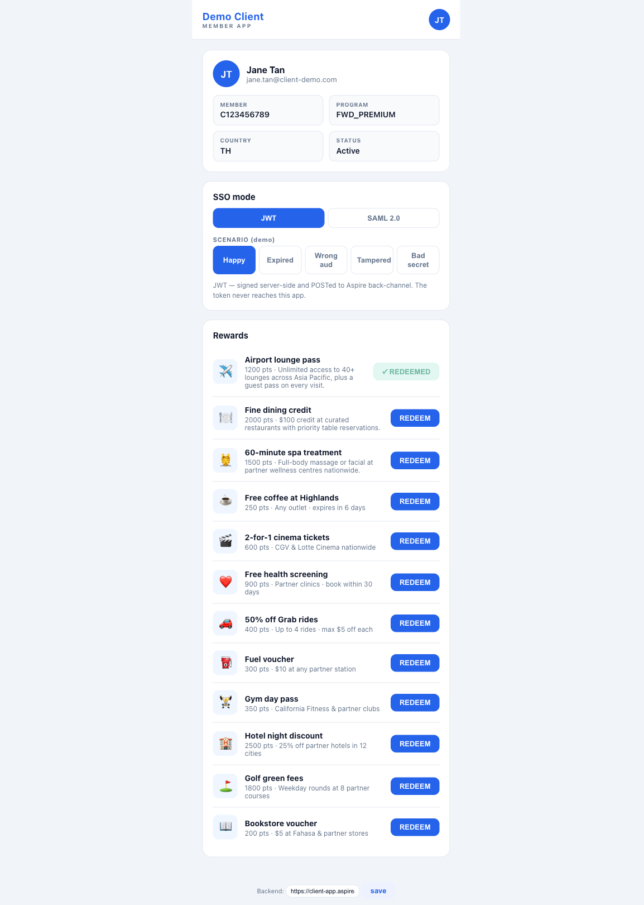

# Silent SSO on Redeem — Demo Walkthrough

*A plain-English guide for anyone — no technical background needed.*

A customer is already signed in to the **partner's** own app. They tap **Redeem** on a reward — and
arrive inside **Aspire's** reward page **already signed in**, never seeing an Aspire login. They
confirm, and they're done.

- ✅ Live & verified end-to-end
- ✅ Works two industry-standard ways: **JWT** and **SAML** — the customer sees the same thing either way
- ✅ No second login for the customer

---

## How it works — the whole journey

The partner owns their customers and their login. Aspire owns the rewards and the redemption. The
magic is the hand-off in the middle — it happens silently.

| # | What happens | Who's involved |
|---|--------------|----------------|
| **1** | Customer signs in to the partner's app | Partner only — Aspire never sees the password |
| **2** | Customer taps **REDEEM** on a reward | Partner app |
| **3** | The app silently hands them to Aspire, who opens the reward page **already signed in** | Partner → Aspire (behind the scenes) |
| **4** | Customer taps **Confirm**, sees "Redeemed", taps **Close** — reward is marked **done** in the app | Aspire → back to Partner |

### The two methods (same result)

| Method | In plain terms |
|--------|----------------|
| **JWT** | The partner's system quietly passes Aspire a signed digital **token** ("this is customer Jane") server-to-server. The customer's device never touches it. |
| **SAML** | The customer's **browser** carries a signed digital **document** to Aspire. Same result, different plumbing. |

Both are industry standards. The customer sees the **exact same thing** — the choice is just which
the partner's systems already support.

---

## Try it yourself — five steps

Open the demo, sign in, and follow along. Each screenshot below is from the live system.

### Step 1 — Open the partner app & sign in

Go to **https://client-app.aspireasia.net** and sign in with **jane** / **demo**.
This is the **partner's** own login — Aspire plays no part here.

### Step 2 — Pick a reward & tap REDEEM

You land on the rewards list. At the top you can switch the demo between **JWT** and **SAML 2.0**,
then tap **REDEEM** on any reward.

### Step 3 — Aspire opens, already signed in

The Aspire reward page opens **inside the app**. Notice the badges: **AUTO SIGNED IN** and
**VIA JWT** — the customer was never asked to log in. Tap **CONFIRM REDEMPTION**.

### Step 4 — Redeemed → close and return

Aspire confirms the redemption and emails a confirmation. Tap **CLOSE AND RETURN TO THE APP**.

### Step 5 — Back in the app, reward marked done

You're back in the partner app, and the reward now shows a green **✓ REDEEMED**. The loop is closed.

---

## Who provides what

The split is the whole point: the **partner** owns the customer; **Aspire** owns the reward and
trusts the partner's proof. Neither holds the other's secrets.

| The Partner (Client) provides | Aspire provides |
|-------------------------------|-----------------|
| **Their own app & login** — they own their customers and how they sign in | **The rewards & the redeem page** — the catalogue and the "auto signed in" experience |
| **Proof of who the customer is** — a signed token (JWT) or document (SAML) | **Verification** — checks the signature is genuine, fresh, and not reused |
| **A private signing key** — kept secret; only the public half is published so Aspire can verify | **A partner ID & secret** — issued to the partner so only the real partner can call in |
| **Who is eligible** — the partner decides who may redeem; Aspire trusts that decision | **The signed-in session** — creates the session and blocks replays and tampering |

**In short:** the partner says *"this is Jane, and she may redeem,"* signed. Aspire checks the
signature, trusts it, and signs Jane in — **without ever seeing Jane's password**.

For the exact technical contract (field names, endpoints), see
[`CLIENT_INTEGRATION.md`](CLIENT_INTEGRATION.md).

---

## Demo access

| | |
|---|---|
| **Open** | https://client-app.aspireasia.net |
| **Sign in** | `jane` / `demo` |
| **Also try** | `arjun` / `demo` — another eligible member |
| **Eligibility** | `mai` / `demo` — signs in, but redeem is blocked (not eligible) |

Switch **JWT ⇄ SAML** at the top of the rewards screen to see both methods — the experience is identical.

---

*Aspire Silent SSO · Redeem Proof of Concept · Demo environment.
The full journey — sign in, redeem, confirm, close, reward-marked-done — is live and verified
end-to-end for both JWT and SAML.*
